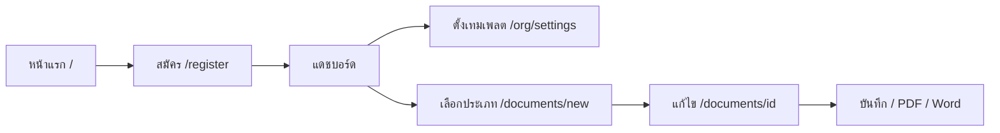
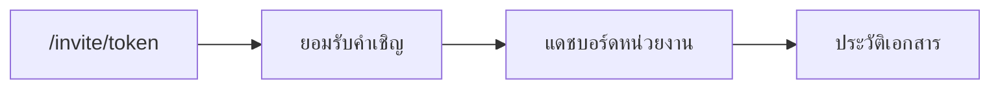
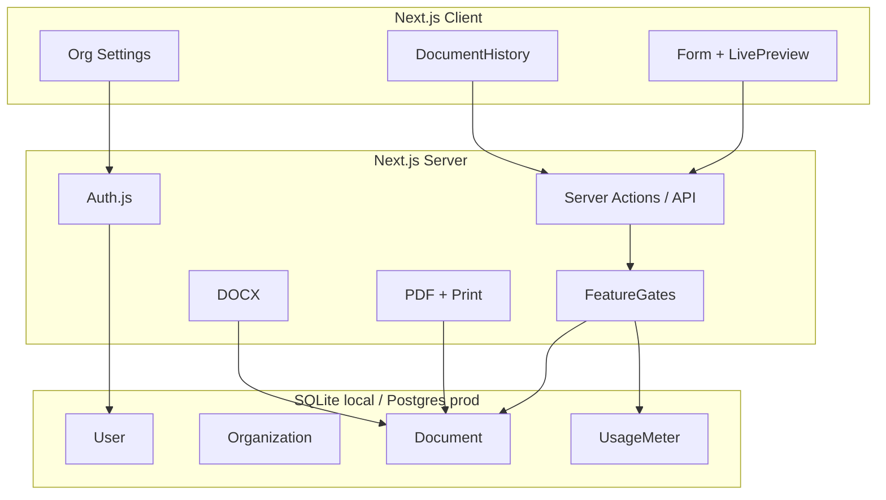

# EasyKrut — เอกสารรวม (Overview)

เอกสารฉบับนี้รวมภาพผลิตภัณฑ์ สถานะปัจจุบัน เส้นทางผู้ใช้ สถาปัตยกรรม แผนราคา และโรดแมปไว้ที่เดียว  
รายละเอียดเชิงแผนงานยาวอยู่ที่ [`PLAN.md`](PLAN.md) · รายละเอียดเส้นทางผู้ใช้อยู่ที่ [`USERFLOW.md`](USERFLOW.md)

**อัปเดตล่าสุด:** หลัง merge userflow (`/documents/new` + onboarding แดชบอร์ด)

---

## 1. ผลิตภัณฑ์คืออะไร

**EasyKrut** = ระบบสร้างเอกสารราชการอิเล็กทรอนิกส์แบบ multi-tenant สำหรับหน่วยงาน

- สร้างหนังสือตามรูปแบบสารบรรณ (พรีวิว A4 สด)
- ทำงานร่วมกันในหน่วยงาน (Organization)
- ส่งออก PDF / Word
- มีแผน Free / Pro / Business + feature gate (Stripe เปิดเมื่อตั้ง env)

**เป้าหมายธุรกิจ:** เริ่มใช้จริงในหน่วยงาน → ขยายเป็น SaaS

---

## 2. สถานะปัจจุบัน (ทำอะไรได้แล้ว)

| หัวข้อ | สถานะ | หมายเหตุ |
|--------|--------|----------|
| สมัคร / เข้าสู่ระบบ / ออกจากระบบ | ✅ | Auth.js credentials |
| สร้างหน่วยงานอัตโนมัติตอนสมัคร | ✅ | ได้ OWNER + แผน Free |
| เชิญสมาชิก (invite token) | ✅ | จากหน้าหน่วยงาน |
| หนังสือภายนอก (ตราครุฑ) | ✅ | form + preview + PDF + Word |
| หนังสือภายใน (บันทึกข้อความ) | ✅ | form + preview + PDF + Word |
| จุดสร้างเอกสารรวม `/documents/new` | ✅ | เลือกประเภทก่อนสร้าง |
| Onboarding แดชบอร์ดว่าง | ✅ | 3 ขั้น: เทมเพลต → สร้าง → ส่งออก |
| บันทึก DRAFT / FINAL + autosave | ✅ | |
| ประวัติเอกสาร + ค้นหา + คัดลอก | ✅ | เรื่อง / วันที่ / ผู้สร้าง |
| เทมเพลตหน่วยงาน | ✅ | เติมค่าเริ่มต้นตอนสร้างเอกสาร |
| Feature gate ตามแผน | ✅ | บล็อกเมื่อชนโควตา |
| Stripe Checkout / Portal / Webhook | ✅ โครงพร้อม | เปิดเมื่อตั้ง env |
| ประเภทอื่น (ประทับตรา, สั่งการ, ฯลฯ) | ⏳ | แสดงเป็น “เร็วๆ นี้” |
| e-Signature / SSO / เลขที่รันอัตโนมัติ | ❌ | นอกขอบเขตตอนนี้ |

### บัญชีทดลอง

```bash
node scripts/seed-demo.js
# อีเมล: demo@easykrut.local
# รหัสผ่าน: demo1234
```

รันแอป: `npm run dev` → [http://localhost:3010](http://localhost:3010)

---

## 3. Userflow รวม

### 3.1 ผู้ใช้ใหม่



1. สมัคร → ได้ User + Organization + Membership OWNER  
2. แดชบอร์ดว่างแสดง **เริ่มต้นใช้งานใน 3 ขั้น**  
3. (แนะนำ) ตั้งเทมเพลตหน่วยงาน  
4. กด **สร้างเอกสาร** → เลือกภายนอกหรือภายใน  
5. กรอก + พรีวิว → บันทึก → ส่งออก  

### 3.2 ผู้ใช้ที่ถูกเชิญ



### 3.3 ผู้ใช้กลับมาใช้ซ้ำ

`/login` → `/dashboard` → เปิดเอกสารล่าสุด หรือค้นจาก `/documents` → คัดลอก/แก้/ส่งออก

### 3.4 อัปเกรดแผน

ชนลิมิต → ข้อความอัปเกรด → `/pricing` → Stripe Checkout (ถ้าตั้ง env) / Portal จากหน้าหน่วยงาน

### 3.5 จุดเข้า UI สำคัญ

| จุด | เส้นทาง | บทบาท |
|-----|---------|--------|
| หน้าแรก | `/` | สรุป 3 ขั้น + CTA สมัคร/เข้าสู่ระบบ |
| แดชบอร์ด | `/dashboard` | สถิติ + onboarding หรือเอกสารล่าสุด |
| เลือกประเภท | `/documents/new` | จุดสร้างหลัก |
| ประวัติ | `/documents` | ค้นหา / คัดลอก / ลบ |
| แก้ไข | `/documents/[id]` | ฟอร์ม + พรีวิว |
| พิมพ์ | `/documents/[id]/print` | A4 สำหรับพิมพ์ |
| หน่วยงาน | `/org/settings` | เทมเพลต / เชิญ / billing |
| ราคา | `/pricing` | Free / Pro / Business |

รายละเอียดเพิ่ม: [`USERFLOW.md`](USERFLOW.md)

---

## 4. ประเภทเอกสาร

อ้างอิงคู่มือสารบรรณ / ระเบียบสำนักนายกรัฐมนตรีฯ

| ลำดับ | ประเภท | สถานะในแอป | ชนิดในระบบ |
|-------|--------|------------|------------|
| 1 | หนังสือภายนอก (ตราครุฑ) | ✅ พร้อมใช้ | `EXTERNAL` |
| 2 | หนังสือภายใน (บันทึกข้อความ) | ✅ พร้อมใช้ | `INTERNAL` |
| 3 | หนังสือประทับตรา | ⏳ เร็วๆ นี้ | (ยังไม่มี) |
| 4 | หนังสือสั่งการ | ⏳ เร็วๆ นี้ | `ORDER` (เตรียมไว้) |
| 5 | หนังสือประชาสัมพันธ์ | ⏳ เร็วๆ นี้ | (แยกจาก ORDER) |
| 6 | หลักฐานในราชการ | ⏳ เร็วๆ นี้ | `CERT` / `MEETING` |

**อย่าผสม** ประกาศ/แถลงการณ์เข้ากับหนังสือสั่งการ

---

## 5. แผนราคาและลิมิต

| แผน | ที่นั่ง | เอกสาร/เดือน | PDF | Word | ราคา/เดือน (เตรียมไว้) |
|-----|--------|--------------|-----|------|------------------------|
| Free | 3 | 20 | ใช่ | ใช่ | 0 |
| Pro | 15 | 200 | ใช่ | ใช่ | 990 บาท |
| Business | 50+ | สูง / เกือบไม่จำกัด | ใช่ | ใช่ | 2,990 บาท |

Feature gate ในโค้ด: `canCreateDocument`, `canInviteMember`, `canExportWord` / `canExportPdf`  
Stripe: `/api/stripe/checkout`, `/api/stripe/portal`, `/api/stripe/webhook` — ใช้เมื่อตั้ง

- `STRIPE_SECRET_KEY`
- `STRIPE_WEBHOOK_SECRET`
- `STRIPE_PRICE_PRO`
- `STRIPE_PRICE_BUSINESS`

---

## 6. สถาปัตยกรรมสั้นๆ



**หลักการ:** ทุกเอกสารผูก `organizationId` — ไม่มี orphan ของผู้ใช้เดี่ยวโดยไม่ผ่านหน่วยงาน

### สแต็กหลัก

| ชั้น | เทคโนโลยี |
|------|-----------|
| App | Next.js (App Router) + TypeScript |
| Auth | Auth.js (NextAuth v5) |
| DB | Prisma + SQLite (local) / Postgres (prod) |
| PDF | `@react-pdf/renderer` + หน้าพิมพ์ A4 |
| Word | `docx` |
| Billing | Stripe |
| ฟอนต์เอกสาร | TH Sarabun / Sarabun + ครุฑ `public/krut.png` |

### โมเดลข้อมูลหลัก

- **User** — อีเมล, ชื่อ, รหัสผ่าน  
- **Organization** — แผน, seat/doc limit, Stripe customer  
- **Membership** — OWNER / ADMIN / MEMBER  
- **Invitation** — token เชิญ  
- **Document** — type, status, payload JSON  
- **OrgTemplate** — ค่าเริ่มต้นฟอร์ม  
- **UsageMeter** — นับเอกสาร/export รายเดือน  

---

## 7. โครงโฟลเดอร์สำคัญ

```text
src/app/
  page.tsx                 # หน้าแรก
  login|register|pricing
  invite/[token]
  (app)/
    dashboard/
    documents/             # รายการ
    documents/new/         # เลือกประเภท
    documents/[id]/        # แก้ไข + print
    org/settings/
  api/export/{pdf,docx}/
  api/stripe/{checkout,portal,webhook}/
src/components/
  editor/                  # External / Internal
  documents/               # Preview + PDF
  billing/
src/lib/
  actions/                 # auth, documents, org
  documents/               # schema, labels, limits, docx
  entitlements.ts
  auth.ts / db.ts / stripe.ts
docs/
  OVERVIEW.md              # เอกสารนี้
  PLAN.md                  # แผนดำเนินการละเอียด
  USERFLOW.md              # เส้นทางผู้ใช้
prisma/schema.prisma
```

---

## 8. สิ่งที่อัปเดตล่าสุด (Userflow)

จาก PR [#1](https://github.com/akhira022/EasyKrut/pull/1):

1. เพิ่ม `/documents/new` เป็นจุดเลือกประเภทก่อนสร้าง  
2. แดชบอร์ดว่างแสดง onboarding 3 ขั้น  
3. รวม CTA สร้างเอกสารจากแดชบอร์ดและประวัติไปทางเดียวกัน  
4. หน้าแรกสรุป 3 ขั้น + ระบุหนังสือภายนอก/ภายใน  
5. เพิ่ม `USERFLOW.md` และอ้างอิงจากแผนงาน  

---

## 9. โรดแมปสั้นๆ

| เฟส | ขอบเขต | สถานะโดยประมาณ |
|------|--------|----------------|
| 0 Scaffold | Next + Prisma + ฟอนต์ | ✅ |
| 1 Auth + Org + Entitlements | สมัคร, invite, แผน | ✅ |
| 2 หนังสือภายนอกครบวงจร | form / preview / CRUD | ✅ |
| 3 Export | PDF + Word + usage | ✅ |
| 4 UX หน่วยงาน | เทมเพลต, autosave, ค้นหา, landing | ✅ ส่วนใหญ่ |
| 5 ประเภทเอกสารเพิ่ม | ภายใน ✅ แล้ว · ที่เหลือทีละชนิด | 🔄 |
| 6 Billing | Stripe โครง ✅ · เปิดขายจริงทีหลัง | 🔄 |

### นอกขอบเขตตอนนี้

- ใบเสร็จ / ภาษี  
- e-Signature  
- แอปมือถือ native  
- เชื่อมระบบสารบรรณภายนอก  
- SSO / White-label  

---

## 10. Acceptance criteria (MVP)

1. ผู้ใช้ A สมัครได้ แล้วเชิญผู้ใช้ B เข้า org เดียวกัน  
2. ทั้งคู่เห็นรายการเอกสารของ org (ตาม role)  
3. สร้างหนังสือภายนอกแล้ว preview ตรงรูปแบบราชการ  
4. บันทึกแล้วเปิดแก้ใหม่ได้หลังรีเฟรช  
5. Export PDF และ Word ได้  
6. ชนโควตา Free แล้วบล็อกพร้อมข้อความอัปเกรด  
7. ประเภทที่ยังไม่พร้อมแสดงเป็น “เร็วๆ นี้”  
8. สร้างเอกสารผ่าน `/documents/new` และแดชบอร์ดว่างมีขั้นตอนเริ่มต้น  

---

## 11. ความเสี่ยงหลัก

| ความเสี่ยง | แนวทาง |
|------------|--------|
| Word ไม่ตรง HTML 100% | ยอมรับความใกล้เคียง; เน้น PDF/พิมพ์เป็นต้นฉบับ |
| ฟอนต์บนเซิร์ฟเวอร์ | รวม TH Sarabun ใน repo สำหรับ PDF |
| ข้อมูลรั่วข้าม org | บังคับ `organizationId` + ตรวจ membership |
| Scope บวม | ทำประเภทเอกสารทีละชนิด ไม่ผสมฟอร์ม |

---

## 12. เอกสารและไฟล์อ้างอิง

| ไฟล์ | เนื้อหา |
|------|---------|
| [`OVERVIEW.md`](OVERVIEW.md) | เอกสารรวมฉบับนี้ |
| [`PLAN.md`](PLAN.md) | แผนดำเนินการละเอียด / เฟส / เกณฑ์รับงาน |
| [`USERFLOW.md`](USERFLOW.md) | เส้นทางผู้ใช้ปัจจุบัน |
| [`../README.md`](../README.md) | วิธีติดตั้งและรัน |
| `ฉบับเต็มคู่มือการเขียนหนังสือราชการ.pdf` | คู่มือสารบรรณ |
| `รูปแบบ_หนังสือภายนอก.pdf` | ตัวอย่างรูปแบบภายนอก |
| `krut-3-cm.png` | ต้นทางตราครุฑ → `public/krut.png` |
