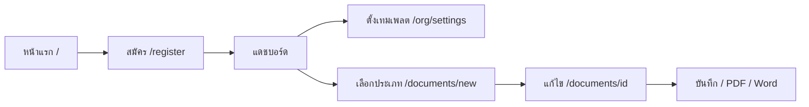
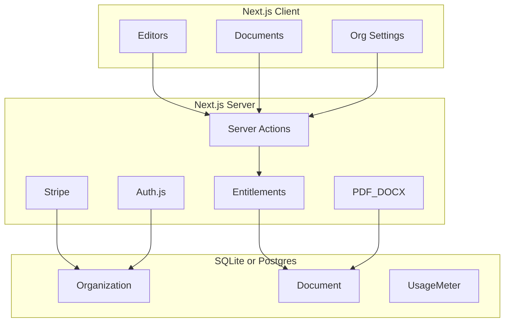

# EasyKrut — เอกสารรวม (Overview)

**เวอร์ชัน:** 1.4  
**สถานะเอกสาร:** ตรงกับโค้ดบน `cursor/mvp-official-documents` (9 ส.ค. 2026)

เอกสารฉบับนี้รวมภาพผลิตภัณฑ์ สถานะปัจจุบัน เส้นทางผู้ใช้ สถาปัตยกรรม แผนราคา โรดแมป และปัญหาที่เจอไว้ที่เดียว  
แผนละเอียด: [`PLAN.md`](PLAN.md) · Userflow: [`USERFLOW.md`](USERFLOW.md)

**อัปเดตล่าสุด:** Version 1.4 — หนังสือประทับตรา (แบบที่ 3) ครบวงจร · ชิ้นถัดไปสั่งการ

---

## 1. ผลิตภัณฑ์คืออะไร

**EasyKrut** = ระบบสร้างเอกสารราชการอิเล็กทรอนิกส์แบบ multi-tenant สำหรับหน่วยงาน

- สร้างหนังสือตามรูปแบบสารบรรณ (พรีวิว A4 สด)
- ทำงานร่วมกันในหน่วยงาน (Organization)
- ส่งออก PDF / Word
- มีแผน Free / Pro / Business + feature gate (Stripe เปิดเมื่อตั้ง env)

**เป้าหมายธุรกิจ:** เริ่มใช้จริงในหน่วยงาน → ขยายเป็น SaaS

**สแต็ก:** Next.js 16.3 · React 19 · Prisma 5 + SQLite (local) · Auth.js v5 · Zod 4 · พอร์ต `3010`

---

## 2. สถานะปัจจุบัน (ตรงกับโค้ด)

| หัวข้อ | สถานะ | หมายเหตุ |
|--------|--------|----------|
| สมัคร / เข้าสู่ระบบ / ออกจากระบบ | ✅ | Auth.js credentials |
| สร้างหน่วยงานอัตโนมัติตอนสมัคร | ✅ | OWNER + แผน Free |
| เชิญสมาชิก (invite token) | ✅ | `/org/settings` + `/invite/[token]` |
| หนังสือภายนอก (ตราครุฑ) | ✅ | form + preview + PDF + Word |
| หนังสือภายใน (บันทึกข้อความ) | ✅ | form + preview + PDF + Word |
| หนังสือประทับตรา | ✅ | form + preview + PDF + Word |
| จุดสร้าง `/documents/new` | ✅ | เลือกประเภทก่อนสร้าง |
| Onboarding แดชบอร์ดว่าง | ✅ | เทมเพลต → สร้าง → ส่งออก |
| DRAFT / FINAL + autosave | ✅ | ~20 วินาที |
| ประวัติ + ค้นหา + คัดลอก + ลบ | ✅ | |
| เทมเพลตหน่วยงาน | ✅ | `OrgTemplate` |
| Feature gate ตามแผน | ✅ | `entitlements.ts` |
| Pricing + Stripe API | ✅ โครง | เปิดขายเมื่อตั้ง env |
| สั่งการ / ประชาสัมพันธ์ / รับรอง | ⏳ | “เร็วๆ นี้” ใน UI |
| DocumentVersion / e-Sign / SSO | ❌ | นอกขอบเขตตอนนี้ |

### บัญชีทดลอง

```bash
npm run db:seed
# หรือ: node scripts/seed-demo.js
# อีเมล: demo@easykrut.local
# รหัสผ่าน: demo1234
```

รัน: `npm run dev` → [http://localhost:3010](http://localhost:3010)

---

## 3. Userflow รวม

### 3.1 ผู้ใช้ใหม่



### 3.2 จุดเข้า UI

| จุด | เส้นทาง |
|-----|---------|
| หน้าแรก | `/` |
| แดชบอร์ด | `/dashboard` |
| เลือกประเภท | `/documents/new` |
| ประวัติ | `/documents` |
| แก้ไข / พิมพ์ | `/documents/[id]` · `/documents/[id]/print` |
| หน่วยงาน | `/org/settings` |
| ราคา | `/pricing` |
| เชิญ | `/invite/[token]` |

รายละเอียด: [`USERFLOW.md`](USERFLOW.md)

---

## 4. ประเภทเอกสาร

| ลำดับ | ประเภท | สถานะ | ชนิดในระบบ |
|-------|--------|--------|------------|
| 1 | หนังสือภายนอก | ✅ | `EXTERNAL` |
| 2 | หนังสือภายใน (บันทึกข้อความ) | ✅ | `INTERNAL` |
| 3 | หนังสือประทับตรา | ✅ | `STAMP` |
| 4 | หนังสือสั่งการ | ⏳ **ถัดไป** | `ORDER` |
| 5 | หนังสือประชาสัมพันธ์ | ⏳ | ยังไม่มี — แยกจาก ORDER |
| 6 | หลักฐานในราชการ | ⏳ | `CERT` / `MEETING` |

---

## 5. แผนราคาและลิมิต

| แผน | ที่นั่ง | เอกสาร/เดือน | PDF | Word | บาท/เดือน |
|-----|--------|--------------|-----|------|-----------|
| Free | 3 | 20 | ใช่ | ใช่ | 0 |
| Pro | 15 | 200 | ใช่ | ใช่ | 990 |
| Business | 50 | 99999 | ใช่ | ใช่ | 2,990 |

Stripe routes: `/api/stripe/checkout` · `/portal` · `/webhook`  
Env: `STRIPE_SECRET_KEY`, `STRIPE_WEBHOOK_SECRET`, `STRIPE_PRICE_PRO`, `STRIPE_PRICE_BUSINESS`

---

## 6. สถาปัตยกรรมสั้นๆ



| ชั้น | ของจริงในโปรเจกต์ |
|------|-------------------|
| App | Next.js 16 App Router + TypeScript |
| UI CSS | `globals.css` utilities (ไม่ใช้ Tailwind package) |
| Auth | Auth.js v5 + Prisma adapter |
| DB | Prisma 5 + SQLite local · Postgres optional via Docker |
| Form | React state ใน editor (ไม่ใช่ react-hook-form) |
| PDF | `@react-pdf/renderer` + TH Sarabun ใน `public/fonts` |
| Word | `docx` |
| Billing | Stripe SDK |

โมเดลหลัก: User · Organization · Membership · Invitation · Document · OrgTemplate · UsageMeter

---

## 7. โครงโฟลเดอร์สำคัญ

```text
src/app/(app)/dashboard|documents|documents/new|documents/[id]|org/settings
src/app/api/export/{pdf,docx} + api/stripe/{checkout,portal,webhook}
src/components/editor|documents|billing
src/lib/actions|documents/{external,internal,stamp}|entitlements|auth|db|stripe
docs/OVERVIEW.md | PLAN.md | USERFLOW.md
prisma/schema.prisma
```

รายละเอียดเต็ม: [`PLAN.md` §4](PLAN.md)

---

## 8. Changelog

| เวอร์ชัน | วันที่ | สิ่งที่รวม |
|---------|--------|-----------|
| 1.0 | 9 ส.ค. 2026 | เอกสารรวม + userflow |
| 1.1 | 9 ส.ค. 2026 | บันทึกข้อความครบ · ล็อกชิ้นถัดไปประทับตรา |
| 1.2 | 9 ส.ค. 2026 | หมวดปัญหาที่เจอ |
| 1.3 | 9 ส.ค. 2026 | **จัดแผนทั้งหมดให้ตรงโค้ด** (สแต็ก, โฟลเดอร์, เฟส, acceptance) |
| 1.4 | 14 ส.ค. 2026 | **หนังสือประทับตราครบ** · ชิ้นถัดไปสั่งการ |

---

## 9. ปัญหาที่เจอ (Known issues)

### 9.1 ผลิตภัณฑ์ / UX

| ปัญหา | สถานะ |
|--------|--------|
| จุดสร้างเอกสารเคยกระจาย / แดชบอร์ดสร้างได้แค่ภายนอก | ✅ แก้ด้วย `/documents/new` |
| Landing/README พูดแค่ภายนอก | ✅ แก้แล้ว |
| OVERVIEW อยู่บน PR draft ยังไม่ขึ้น branch หลัก | ✅ merge แล้ว |
| ประเภทไม่พร้อมต้องติดป้ายชัด | ✅ “เร็วๆ นี้” |

### 9.2 เทคนิค

| ปัญหา | สถานะ |
|--------|--------|
| lint `useEffectEvent` ใน editor | ⏳ debt |
| seed ใช้ `require()` | ⏳ debt |
| `middleware` deprecated → `proxy` | ⏳ debt |
| PDF/Word ≠ HTML 100% | ยอมรับ MVP |
| Stripe ยังไม่ตั้ง env จริง | ⏳ Phase 6 |

### 9.3 กระบวนการ

| ปัญหา | แนวทาง |
|--------|--------|
| UI automation ล็อกอินพลาด ทำให้งานดูช้า | smoke ด้วย seed/curl ก่อน |
| `gh pr merge` ไม่ผ่านบางครั้ง | merge เข้า base ด้วย git ได้ |
| แผนใน docs ไม่ตรงโค้ด (โฟลเดอร์เก่า, MVP แค่ภายนอก, react-hook-form) | ✅ จัดรอบ v1.3 |

---

## 10. โรดแมป

| เฟส | สถานะ |
|------|--------|
| 0–4 Scaffold → UX/userflow | ✅ |
| 5 ประเภทเอกสาร | 🔄 ภายนอก+ภายใน+ประทับตรา ✅ · **ถัดไปสั่งการ** |
| 6 Billing เปิดขาย | 🔄 โครงพร้อม |

### ชิ้นถัดไป

1. สั่งการ (คำสั่ง)  
2. ประชาสัมพันธ์  
3. รับรอง / รายงานประชุม  

### Debt คู่ขนาน

- lint editor · middleware→proxy · seed eslint  


### นอกขอบเขตตอนนี้

ใบเสร็จ/ภาษี · e-Sign · SSO · เลขที่รันอัตโนมัติ · แชร์ลิงก์ · API สารบรรณ · White-label · แอปมือถือ · DocumentVersion  

---

## 11. Acceptance criteria

| # | เกณฑ์ | สถานะ |
|---|--------|--------|
| 1–8 | MVP เดิม (สมัคร, เชิญ, ภายนอก, บันทึก, export, ลิมิต, เร็วๆ นี้, userflow) | ✅ |
| 9 | หนังสือภายในครบวงจร | ✅ |
| 10 | หนังสือประทับตราครบวงจร | ✅ |
| 11 | หนังสือสั่งการครบวงจร | ⏳ |

---

## 12. ความเสี่ยงหลัก

| ความเสี่ยง | แนวทาง |
|------------|--------|
| Word ≠ HTML | เน้น PDF |
| รั่วข้าม org | `organizationId` + membership |
| Scope บวม | ทีละประเภท · ล็อกสั่งการ |
| แผนไม่ตรงของจริง | อัปเดต PLAN/OVERVIEW คู่ release |

---

## 13. เอกสารอ้างอิง

| ไฟล์ | เนื้อหา |
|------|---------|
| [`OVERVIEW.md`](OVERVIEW.md) | เอกสารรวมฉบับนี้ |
| [`PLAN.md`](PLAN.md) | แผนดำเนินการละเอียด (ตรงโค้ด) |
| [`USERFLOW.md`](USERFLOW.md) | เส้นทางผู้ใช้ |
| [`../README.md`](../README.md) | ติดตั้ง / รัน |
| คู่มือ PDF ใน `docs/` | รูปแบบหนังสือราชการ |
| `krut-3-cm.png` | ต้นทางตราครุฑ → `public/krut.png` |
