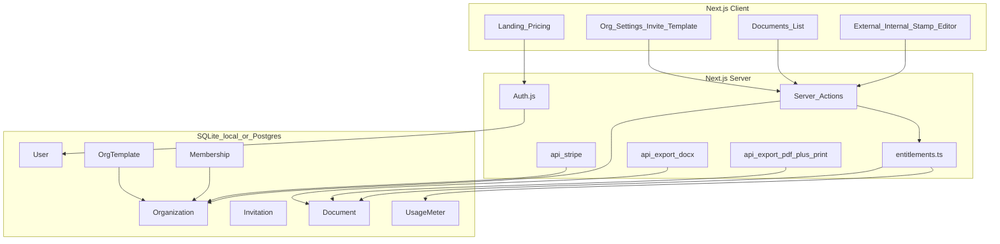

# EasyKrut — แผนดำเนินการ (Implementation Plan)

**ผลิตภัณฑ์:** ระบบสร้างเอกสารราชการอิเล็กทรอนิกส์แบบหลายผู้ใช้ในหน่วยงาน  
**เป้าหมายธุรกิจ:** เริ่มใช้งานจริงในหน่วยงาน แล้วขยายเป็น SaaS หารายได้ในอนาคต  
**สถานะโปรเจกต์ (14 ส.ค. 2026):** MVP ใช้งานได้แล้ว — ภายนอก + ภายใน + ประทับตรา + userflow + Stripe โครงพร้อม  
**Branch หลักงาน:** `cursor/mvp-official-documents`  
**สแต็กปัจจุบัน:** Next.js 16.3 · React 19 · Prisma 5 · SQLite local · Auth.js v5 · Zod 4 · พอร์ต `3010`

> เอกสารรวมสถานะ + userflow + ปัญหาที่เจอ: [`OVERVIEW.md`](OVERVIEW.md) (v1.5)

---

## 0. สถานะเฟสรวดเร็ว

| เฟส | ขอบเขต | สถานะ |
|------|--------|--------|
| 0 Scaffold | Next App Router, Prisma, ฟอนต์, CSS A4 | ✅ เสร็จ |
| 1 Auth + Org + Entitlements | สมัคร, session, invite, แผน Free/Pro/Business | ✅ เสร็จ |
| 2 หนังสือภายนอก | schema, editor, preview, CRUD | ✅ เสร็จ |
| 3 Export | PDF (`@react-pdf/renderer`), print A4, DOCX, UsageMeter | ✅ เสร็จ |
| 4 UX หน่วยงาน | เทมเพลต, autosave, ค้นหา, duplicate, landing, pricing, `/documents/new` | ✅ เสร็จ |
| 5 ประเภทเอกสารเพิ่ม | ภายใน ✅ · ประทับตรา ✅ · **ถัดไป: สั่งการ** · ประชาสัมพันธ์ · รับรอง · รายงานการประชุม | 🔄 กำลังทำ |
| 6 Billing จริง | เปิด Stripe env + conversion | 🔄 โครงโค้ดพร้อม / ยังไม่เปิดขาย |

**ชิ้นงานถัดไปที่ล็อก:** หนังสือสั่งการ (คำสั่ง)

---

## 1. ตัดสินใจที่ล็อกแล้ว (อัปเดตตามของจริง)

| หัวข้อ | ค่าที่เลือก / สถานะ |
|--------|---------------------|
| ผู้ใช้ | Multi-tenant: Organization มีหลายบัญชี |
| ข้อมูล local | **SQLite** (`prisma/dev.db`) — Postgres ผ่าน `docker compose` เมื่อพร้อมโปรดักชัน |
| Auth | Auth.js (NextAuth v5) — อีเมล/รหัสผ่าน + invite token |
| เอกสารพร้อมใช้ | **EXTERNAL** + **INTERNAL** + **STAMP** ครบ form / preview / บันทึก / PDF / Word |
| ประเภทถัดไป | ORDER (คำสั่ง) → ประชาสัมพันธ์ → CERT (แบบที่ 10) → MEETING (รายงานการประชุม แบบที่ 11) |
| Export PDF | `@react-pdf/renderer` + หน้า `/documents/[id]/print` |
| Export Word | `docx` ผ่าน `/api/export/docx` |
| ฟอร์ม editor | React state ใน `ExternalEditor` / `InternalEditor` / `StampEditor` (ไม่ได้ใช้ react-hook-form) |
| สไตล์ UI | CSS utilities ใน `globals.css` + next/font (Kanit, Sarabun) — ไม่ได้ใช้ Tailwind package |
| หารายได้ | schema + feature gate + Stripe Checkout/Portal/Webhook (เปิดเมื่อตั้ง env) |
| Userflow | จุดสร้างรวมที่ `/documents/new` — ดู [`USERFLOW.md`](USERFLOW.md) |
| Prototype เดิม | ลบแล้ว — อ้างอิง layout จาก docs/คู่มือ ไม่ต่อ PHP |
| ตราครุฑ | `docs/krut-3-cm.png` → `public/krut.png` |
| พอร์ต dev | `3010` (`AUTH_URL` ต้องตรง) |

---

## 2. สถาปัตยกรรมภาพรวม (ตรงกับโค้ด)



**หลักการ:** ทุกเอกสารผูก `organizationId` — สมัครแล้วสร้าง org + Membership OWNER อัตโนมัติ

---

## 3. โมเดลข้อมูล (Prisma จริง)

อ้างอิง `prisma/schema.prisma` — ไม่มีตาราง `DocumentVersion` / `PlanDefinition` (แผนอยู่ในโค้ด `entitlements.ts`)

```text
User
  id, email, name, passwordHash, createdAt, updatedAt
  (+ Account / Session สำหรับ Auth.js adapter)

Organization
  id, name, slug
  planKey          // "free" | "pro" | "business"
  seatLimit, docLimitMonthly
  stripeCustomerId // null จนกว่าเปิด billing
  createdAt, updatedAt

Membership
  id, userId, organizationId
  role             // OWNER | ADMIN | MEMBER
  unique(userId, organizationId)

Invitation
  id, organizationId, email, role, token, expiresAt, acceptedAt

Document
  id, organizationId, createdById
  type             // EXTERNAL | INTERNAL | STAMP | MEETING | ORDER | CERT
                   // (ประชาสัมพันธ์ยังไม่มีใน constants — เพิ่มเมื่อเริ่มทำ)
  title, status    // DRAFT | FINAL
  payload          // JSON string
  createdAt, updatedAt

OrgTemplate
  agencyName, agencyAddress, contactUnit, docNumPrefix
  tel, fax, email  (+ department legacy)

UsageMeter
  organizationId, yearMonth
  docsCreated, exportsCount
  unique(organizationId, yearMonth)
```

**Feature gate:** `canCreateDocument`, `canInviteMember`, `canExportWord`, `canExportPdf` ใน `src/lib/entitlements.ts`

### แผนราคา (จากโค้ด)

| แผน | ที่นั่ง | เอกสาร/เดือน | PDF | Word | บาท/เดือน |
|-----|--------|--------------|-----|------|-----------|
| Free | 3 | 20 | ใช่ | ใช่ | 0 |
| Pro | 15 | 200 | ใช่ | ใช่ | 990 |
| Business | 50 | 99999 | ใช่ | ใช่ | 2,990 |

---

## 4. โครงโฟลเดอร์จริง

```text
src/app/
  page.tsx                          # หน้าแรก
  login/ page.tsx
  register/ page.tsx
  pricing/ page.tsx
  invite/[token]/                   # รับคำเชิญ
  (app)/
    layout.tsx                      # ต้อง login
    dashboard/page.tsx
    documents/
      page.tsx                      # ประวัติ + ค้นหา
      new/page.tsx                  # เลือกประเภท
      [id]/page.tsx                 # แก้ไข
      [id]/print/                   # พิมพ์ A4
    org/settings/                   # เทมเพลต + สมาชิก + invite + billing
                                    # (ไม่มี members/page.tsx แยก)
  api/
    auth/[...nextauth]/
    export/pdf|docx/
    stripe/checkout|portal|webhook/
src/components/
  editor/ExternalEditor.tsx | InternalEditor.tsx | StampEditor.tsx
  documents/*Preview.tsx + pdf/*
  billing/*
src/lib/
  actions/{auth,documents,org}.ts
  documents/{external,internal,stamp}/{schema,docx}.ts
  documents/{labels,limits,payload,build-pdf}.ts
  entitlements.ts, auth.ts, db.ts, stripe.ts, thai.ts, mail.ts
src/middleware.ts                   # เตือน deprecated → ย้ายเป็น proxy ภายหลัง
prisma/schema.prisma
public/krut.png + public/fonts/THSarabun*
docs/OVERVIEW.md | PLAN.md | USERFLOW.md
```

---

## 5. ฟีเจอร์ — สถานะเทียบแผน

### 5.1 Must-have (Phase 1–3) — ✅ ครบ

- สมัคร / เข้าสู่ระบบ / ออกจากระบบ  
- สร้างหน่วยงานอัตโนมัติ + เชิญสมาชิก  
- บทบาท OWNER / ADMIN / MEMBER  
- หนังสือภายนอก form ↔ preview สด  
- เลขไทย + วันที่ พ.ศ.  
- ย่อหน้าหลายช่อง / DRAFT–FINAL  
- ประวัติเอกสาร + ค้นหา  
- Export PDF + Word  
- Zoom A4 / feature gate Free  

### 5.2 Should-have (Phase 4) — ✅ ส่วนใหญ่ครบ

| รายการ | สถานะ |
|--------|--------|
| เทมเพลตหน่วยงาน | ✅ |
| คัดลอกเอกสาร | ✅ |
| Autosave | ✅ (~20 วินาที) |
| พิมพ์หน้าเอกสาร | ✅ `/print` |
| Responsive แท็บ Form/Preview | ✅ ใน editor |
| จุดสร้าง `/documents/new` + onboarding | ✅ |
| Landing + Pricing | ✅ |
| DocumentVersion (ประวัติเวอร์ชัน) | ❌ ยังไม่ทำ — เลื่อน |

### 5.3 Document types (Phase 5)

| ลำดับ | ประเภท | สถานะ | ชนิดในระบบ |
|-------|--------|--------|------------|
| 1 | หนังสือภายนอก | ✅ | `EXTERNAL` |
| 2 | หนังสือภายใน (บันทึกข้อความ) | ✅ | `INTERNAL` |
| 3 | หนังสือประทับตรา | ✅ | `STAMP` |
| 4 | หนังสือสั่งการ | ⏳ **ถัดไป** | `ORDER` (มีใน constants แล้ว) |
| 5 | หนังสือประชาสัมพันธ์ | ⏳ | ยังไม่มี — แยกจาก ORDER |
| 6 | หนังสือรับรอง | ⏳ | `CERT` · แบบที่ 10 |
| 7 | รายงานการประชุม | ⏳ | `MEETING` · แบบที่ 11 |

**กฎ:** แต่ละประเภท = Zod schema + Editor + Preview + PDF + DOCX แยกกัน · อย่าผสมประกาศเข้า ORDER · อย่าผสมรับรองกับรายงานการประชุม

**หนังสือภายนอกที่รองรับแล้ว:** ชั้นความเร็ว, ส่วนราชการ+ที่ตั้ง, เรื่อง, คำขึ้นต้น, อ้างถึง/สิ่งที่ส่งมาด้วย, ข้อความ, คำลงท้าย, ชื่อในวงเล็บ, ตำแหน่ง, ส่วนราชการเจ้าของเรื่อง, โทร./โทรสาร/อีเมล, สำเนาส่ง

**บันทึกข้อความที่รองรับแล้ว:** ส่วนราชการ / ที่ / วันที่ / เรื่อง มีเส้นคั่นตามกระดาษแบบที่ 2

#### รายงานการประชุม (ยังไม่ทำ — สเปกที่ล็อกตามระเบียบข้อ 25)

ใช้ชื่อ **รายงานการประชุม** เท่านั้น (ไม่ใช้ บันทึกการประชุม / รายงานประชุม / ประชุม)

| หัวข้อ | ค่า / ข้อห้ามใช้คำ |
|--------|---------------------|
| รายงานการประชุม | ชื่อคณะหรือชื่อการประชุม |
| ครั้งที่ | รายปีปฏิทิน เช่น 1/2569 |
| เมื่อ | วัน เดือน ปี พ.ศ. ที่ประชุม |
| ณ | สถานที่ประชุม |
| ผู้มาประชุม | กรรมการที่มา · ไม่ใช้คำว่าผู้เข้าร่วมประชุม |
| ผู้ไม่มาประชุม | ถ้ามี |
| ผู้เข้าร่วมประชุม | ผู้ที่ไม่ได้เป็นคณะ (ถ้ามี) |
| เริ่มประชุมเวลา | ไม่ใช้ “เปิดประชุม” |
| ข้อความ | วาระ + มติ/ข้อสรุป |
| เลิกประชุมเวลา | ไม่ใช้ “ปิดประชุม” |
| ผู้จดรายงานการประชุม | ไม่ใช้ “ผู้บันทึก” |

ไฟล์ `docs/ขอเชิญเข้าร่วมการประชุม….docx` เป็นตัวอย่างหนังสือภายนอกเชิญประชุม ไม่ใช่แบบที่ 11

### 5.4 Monetization (Phase 6) — โครง ✅ / เปิดขาย ⏳

- ✅ หน้า `/pricing`  
- ✅ `/api/stripe/checkout|portal|webhook`  
- ✅ Usage ในหน้าหน่วยงาน  
- ✅ Soft paywall เมื่อชนลิมิต  
- ⏳ ตั้ง Stripe env จริง + products  
- ❌ watermark Free / ใบเสร็จภาษี  

Env ที่ต้องมีเมื่อเปิดขาย: `STRIPE_SECRET_KEY`, `STRIPE_WEBHOOK_SECRET`, `STRIPE_PRICE_PRO`, `STRIPE_PRICE_BUSINESS`

### 5.5 Later / ขยายตลาด — ❌

SSO, e-Signature, เลขที่รันอัตโนมัติ, แชร์ลิงก์, API สารบรรณ, White-label, แอปมือถือ native

---

## 6. รายละเอียดเฟส + ของที่เหลือ

### Phase 0–4 — ✅ ปิดแล้ว

ดูประวัติ commit บน `cursor/mvp-official-documents` (MVP → internal → PDF fonts → userflow → docs)

### Phase 5 — 🔄 กำลังทำ

ลำดับบังคับ:
1. ~~ประทับตรา (แบบที่ 3)~~ ✅  
2. **สั่งการ** (เริ่มคำสั่ง) — schema + form + preview + PDF/Word + เปิดใน `/documents/new`  
3. ประชาสัมพันธ์ (ประกาศ)  
4. หนังสือรับรอง (แบบที่ 10)  
5. รายงานการประชุม (แบบที่ 11) 

### Phase 6 — 🔄 พร้อมเปิดเมื่อมีลูกค้าจ่ายเงิน

1. สร้าง Stripe products/prices  
2. ใส่ env + ทดสอบ webhook  
3. บังคับลิมิต + ข้อความอัปเกรดบน production  
4. (ภายหลัง) วัด conversion: `hit_limit`, `checkout_started`

### Debt คู่ขนาน (ไม่บล็อกสั่งการ)

1. แก้ lint `useEffectEvent` ใน editor  
2. ย้าย `middleware` → `proxy` (Next.js 16)  
3. ปรับ `scripts/seed-demo.js` ให้ผ่าน eslint  

---

## 7. Acceptance criteria — สถานะตรวจ

| # | เกณฑ์ | สถานะ |
|---|--------|--------|
| 1 | สมัคร + เชิญเข้า org เดียวกัน | ✅ |
| 2 | เห็นเอกสารตาม role | ✅ |
| 3 | หนังสือภายนอก preview ตรงรูปแบบ | ✅ |
| 4 | บันทึกแล้วเปิดแก้ได้หลังรีเฟรช | ✅ |
| 5 | Export PDF + Word | ✅ |
| 6 | ชนโควตา Free แล้วบล็อก + อัปเกรด | ✅ |
| 7 | ประเภทไม่พร้อมแสดง “เร็วๆ นี้” | ✅ |
| 8 | สร้างผ่าน `/documents/new` + onboarding | ✅ |
| 9 | หนังสือภายใน (บันทึกข้อความ) ครบวงจร | ✅ |
| 10 | หนังสือประทับตรา ครบวงจร | ✅ |
| 11 | หนังสือสั่งการ ครบวงจร | ⏳ ถัดไป |

---

## 8. ความเสี่ยงและแนวกัน

| ความเสี่ยง | แนวทาง |
|------------|--------|
| Layout Word ≠ HTML 100% | ยอมรับ MVP · เน้น PDF เป็นต้นฉบับ |
| ฟอนต์บนเซิร์ฟเวอร์ | มี TH Sarabun ใน `public/fonts` แล้ว |
| Multi-tenant รั่วข้าม org | บังคับ `organizationId` + membership ทุก query |
| Scope บวม | ทำทีละประเภท · ชิ้นถัดไป = สั่งการเท่านั้น |
| เอกสารแผนไม่ตรงโค้ด | อัปเดต PLAN/OVERVIEW คู่กับของจริง (รอบนี้ v1.5) |
| Lint / middleware debt | เก็บคู่ขนาน ไม่บล็อกฟีเจอร์เอกสาร |
| Stripe ยังไม่ตั้ง env | อย่าเคลมว่า “เปิดขายแล้ว” จนกว่าใส่ keys |

ปัญหาที่เจอรอบล่าสุด: [`OVERVIEW.md` §9](OVERVIEW.md)

---

## 9. งานถัดไปตอนนี้ (ลำดับลงมือ)

1. ออกแบบ schema หนังสือสั่งการ (คำสั่ง ตามคู่มือ)  
2. ใช้ `DocumentType.ORDER` + labels + `/documents/new`  
3. Editor + Preview + PDF + DOCX  
4. ทดสอบสร้าง/บันทึก/ส่งออก  
5. อัปเดต OVERVIEW/PLAN/USERFLOW หลังปิดชิ้น  
6. (คู่ขนาน) เก็บ lint / middleware debt  

---

## 10. นอกขอบเขตตอนนี้

- Stripe เปิดขายจริง / ใบเสร็จ / ภาษี  
- DocumentVersion  
- e-Signature / SSO  
- เลขที่หนังสือรันอัตโนมัติ  
- แชร์ลิงก์อ่านอย่างเดียว  
- API สารบรรณภายนอก / White-label  
- แอปมือถือ native  
