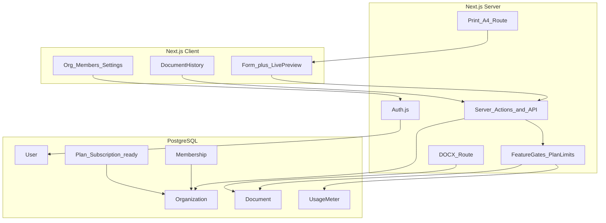

# EasyKrut — แผนดำเนินการ (Implementation Plan)

**ผลิตภัณฑ์:** ระบบสร้างเอกสารราชการอิเล็กทรอนิกส์แบบหลายผู้ใช้ในหน่วยงาน  
**เป้าหมายธุรกิจ:** เริ่มใช้งานจริงในหน่วยงาน แล้วขยายเป็น SaaS หารายได้ในอนาคต  
**สถานะต้นทาง:** พอร์ตจาก prototype HTML/JS เดิมเป็น Next.js แล้ว (ไฟล์ต้นฉบับถูกลบ)

> เอกสารรวมสถานะ + userflow + โรดแมปแบบย่อ: [`OVERVIEW.md`](OVERVIEW.md)

---

## 1. ตัดสินใจที่ล็อกแล้ว

| หัวข้อ | ค่าที่เลือก |
|--------|-------------|
| ผู้ใช้ | Multi-tenant: หน่วยงาน (Organization) มีหลายบัญชี |
| ข้อมูล | SQLite (local MVP) — พร้อมสลับ PostgreSQL ในโปรดักชัน |
| Auth | Auth.js (NextAuth v5) — อีเมล/รหัสผ่าน + invite เข้าหน่วยงาน |
| MVP เอกสาร | หนังสือภายนอกเท่านั้น ให้ครบ form / preview / บันทึก / PDF / Word |
| ประเภทอื่น | เฟสถัดไป: ภายใน → ประชุม → สั่งการ → รับรอง |
| Export PDF | `@react-pdf/renderer` + หน้าพิมพ์ A4 (CSS) |
| Export Word | ไลบรารี `docx` ผ่าน Route Handler |
| หารายได้ | schema + feature gate + Stripe Checkout/Portal/Webhook (เปิดเมื่อตั้ง env) |
| Userflow | ดู [`docs/USERFLOW.md`](USERFLOW.md) — จุดสร้างเอกสารผ่าน `/documents/new` |
| Prototype เดิม | อ้างอิง layout/UX แล้วสร้างแอป Next.js ใหม่ใน repo (ไม่ต่อ PHP) |
| ตราครุฑ | `docs/krut-3-cm.png` → `public/krut.png` |

---

## 2. สถาปัตยกรรมภาพรวม



**หลักการ:** ทุกเอกสารผูกกับ `organizationId` — ไม่มีเอกสาร orphan ของผู้ใช้เดี่ยวที่ไม่ผ่านหน่วยงาน (ผู้ใช้ใหม่สร้าง org ส่วนตัวอัตโนมัติตอนสมัคร เพื่อรองรับทั้งบุคคลและทีม)

---

## 3. โมเดลข้อมูล (Prisma — เตรียม monetization)

```text
User
  id, email, name, passwordHash, createdAt

Organization
  id, name, slug
  planKey          // "free" | "pro" | "business" (default free)
  seatLimit        // จากแผน
  docLimitMonthly  // จากแผน
  stripeCustomerId // null จนกว่าจะเปิด billing
  createdAt

Membership
  id, userId, organizationId
  role             // OWNER | ADMIN | MEMBER
  unique(userId, organizationId)

Invitation
  id, organizationId, email, role, token, expiresAt, acceptedAt

Document
  id, organizationId, createdById
  type             // EXTERNAL | INTERNAL | MEETING | ORDER | CERT
  title            // จากเรื่อง / ชื่อไฟล์แสดง
  status           // DRAFT | FINAL
  payload          // Json — ฟิลด์ฟอร์มตามประเภท
  createdAt, updatedAt

DocumentVersion    // optional Phase 2+
  id, documentId, payload, createdById, createdAt

UsageMeter
  id, organizationId, yearMonth  // "2026-08"
  docsCreated, exportsCount
  unique(organizationId, yearMonth)

PlanDefinition     // seed ในโค้ดหรือตาราง
  key, name, seatLimit, docLimitMonthly, exportWord, exportPdf, priceMonthly
```

**Feature gate (โค้ดกลาง):** `canCreateDocument(org)`, `canExportWord(org)`, `canInviteMember(org)` อ่านจาก `planKey` + `UsageMeter` — UI แสดง upgrade hint เมื่อชนเพดาน โดยยังไม่ต้องมีหน้าชำระเงินใน MVP

### แผนราคาที่เตรียมไว้ (ยังไม่เปิดขาย)

| แผน | ที่นั่ง | เอกสาร/เดือน | PDF | Word | หมายเหตุ |
|-----|--------|--------------|-----|------|----------|
| Free | 3 | 20 | ใช่ | ใช่ (watermark อ่อนในอนาคตได้) | ทดลองหน่วยงานเล็ก |
| Pro | 15 | 200 | ใช่ | ใช่ | เป้าหมายหารายได้หลัก |
| Business | 50+ | ไม่จำกัด / สูง | ใช่ | ใช่ | เทมเพลตหน่วยงาน + SSO ภายหลัง |

---

## 4. โครงโฟลเดอร์แอป Next.js

```text
apps/web หรือ root next app/
  app/
    (marketing)/page.tsx          # หน้าแรก / ราคา (stub)
    (auth)/login|register|invite
    (app)/
      layout.tsx                  # ต้อง login
      dashboard/page.tsx
      documents/
        page.tsx                  # ประวัติ
        new/page.tsx              # สร้างใหม่
        [id]/page.tsx            # แก้ไข
        [id]/print/page.tsx      # หน้าพิมพ์ A4
      org/
        settings/page.tsx
        members/page.tsx
      api/export/docx/route.ts
  components/
    editor/FormPanel.tsx
    editor/PreviewPanel.tsx
    documents/ExternalLetter.tsx
  lib/
    thai.ts                       # toThaiNumber, getThaiDate จาก script.js
    documents/registry.ts
    documents/external/schema.ts
    auth.ts
    entitlements.ts               # feature gates
    db.ts
  prisma/schema.prisma
  public/krut.png
```

พอร์ต logic จาก [`script.js`](../script.js): header ครุฑ / วันที่ พ.ศ. / เรื่อง·เรียน·อ้างถึง·สิ่งที่ส่งมาด้วย / ย่อหน้าเยื้อง 2.5cm / ลงท้าย·ลายเซ็น / ติดต่อท้ายกระดาษ

---

## 5. ฟีเจอร์ที่ควรมี (จัดกลุ่ม)

### 5.1 Must-have — MVP (Phase 1–3)

- สมัคร / เข้าสู่ระบบ / ออกจากระบบ  
- สร้างหน่วยงานอัตโนมัติตอนสมัคร + เชิญสมาชิกด้วยอีเมล  
- บทบาท OWNER / ADMIN / MEMBER (MEMBER สร้าง/แก้เอกสารของตัวเอง; ADMIN ดูเอกสารใน org)  
- สร้าง·แก้ไข **หนังสือภายนอก** แบบ form ↔ preview สด (คง UX จาก prototype)  
- แปลงเลขไทย + วันที่ พ.ศ.  
- เพิ่มย่อหน้าได้หลายช่อง  
- บันทึก DRAFT / ทำเครื่องหมาย FINAL  
- รายการประวัติเอกสารในหน่วยงาน (ค้นหาตามเรื่อง, วันที่, ผู้สร้าง)  
- Export PDF ผ่านหน้าพิมพ์มาตรฐาน A4  
- Export Word (`.docx`) ตาม layout ภายนอก  
- Zoom ดูขนาดจริง A4  
- จำกัดตามแผน Free ผ่าน feature gate (แม้ยังไม่เก็บเงิน)

### 5.2 Should-have — หลัง MVP ไม่นาน (Phase 4)

- เทมเพลตหน่วยงาน: ส่วนราชการเจ้าของหนังสือ, ที่ตั้ง, ส่วนราชการเจ้าของเรื่อง, โทร, อีเมล, คำนำหน้าเลขที่หนังสือ  
- คัดลอกเอกสารเป็นฉบับใหม่  
- Autosave ทุก N วินาที  
- ประวัติเวอร์ชันย่อ (DocumentVersion)  
- พิมพ์เฉพาะหน้าเอกสาร (ซ่อน UI)  
- Responsive: มือถือสลับแท็บ Form / Preview  

### 5.3 Document types — ตามคู่มือ 6 ชนิด (Phase 5)

อ้างอิง [`docs/ฉบับเต็มคู่มือการเขียนหนังสือราชการ.pdf`](ฉบับเต็มคู่มือการเขียนหนังสือราชการ.pdf) และระเบียบสำนักนายกรัฐมนตรีว่าด้วยงานสารบรรณ พ.ศ. 2526

| ลำดับ | ประเภท | ชนิดย่อย / หมายเหตุ | Prisma type (เมื่อสร้าง) |
|-------|--------|---------------------|--------------------------|
| 1 | หนังสือภายนอก | แบบที่ 1 กระดาษตราครุฑ — MVP ปรับให้ครบข้อ 11 แล้ว | EXTERNAL |
| 2 | หนังสือภายใน | บันทึกข้อความ (แบบที่ 2) | INTERNAL |
| 3 | หนังสือประทับตรา | แบบที่ 3 — ใช้แทนการลงชื่อในเรื่องไม่สำคัญ | STAMP *(ยังไม่มีในโค้ด)* |
| 4 | หนังสือสั่งการ | คำสั่ง → ระเบียบ → ข้อบังคับ | ORDER (เริ่มจากคำสั่ง) |
| 5 | หนังสือประชาสัมพันธ์ | ประกาศ → แถลงการณ์ → ข่าว | PR *(แยกจาก ORDER)* |
| 6 | หลักฐานในราชการ | หนังสือรับรอง, รายงานประชุม, บันทึก, หนังสืออื่น | CERT / MEETING |

**อย่าผสม** ประกาศ/แถลงการณ์เข้ากับ ORDER — สั่งการ ≠ ประชาสัมพันธ์

แต่ละประเภท = schema Zod + Form + Preview ใน `registry` — ไม่แชร์ฟอร์มภายนอกทั้งก้อน

**หนังสือภายนอก (ข้อ 11) ที่รองรับแล้ว:** ชั้นความเร็ว, ส่วนราชการ+ที่ตั้ง, เรื่อง, คำขึ้นต้น, อ้างถึง/สิ่งที่ส่งมาด้วย (หลายรายการ), ข้อความ, คำลงท้าย, ชื่อเต็มในวงเล็บ, ตำแหน่ง, ส่วนราชการเจ้าของเรื่อง, โทร./โทรสาร/อีเมล, สำเนาส่ง

### 5.4 Monetization-ready — โครงไว้ก่อน เปิดขายทีหลัง (Phase 6)

- หน้า Pricing (เนื้อหาแผน Free/Pro/Business)  
- Stripe Customer + Checkout + Customer Portal (เมื่อพร้อม)  
- Webhook อัปเดต `planKey`, `seatLimit`, `docLimitMonthly`  
- Usage dashboard ในหน้า org settings  
- Soft paywall: ปุ่ม “อัปเกรด” เมื่อชนลิมิต  
- (ภายหลัง) watermark PDF แผน Free, ลบเมื่อเป็น Pro  
- (ภายหลัง) ออกใบเสร็จ / ภาษี ตามตลาดไทยถ้าจำเป็น  

### 5.5 Later / ขยายตลาด

- SSO / ผูก Google Workspace  
- e-Signature / แนบลายเซ็นรูป  
- เลขที่หนังสือรันอัตโนมัติต่อปีงบประมาณ  
- แชร์ลิงก์อ่านอย่างเดียว  
- API สำหรับระบบสารบรรณภายนอก  
- White-label หน่วยงานใหญ่  

---

## 6. เฟสดำเนินการ

### Phase 0 — Scaffold (1–2 วัน)
- สร้าง Next.js App Router + TypeScript + Tailwind  
- Prisma + PostgreSQL (local Docker หรือ Neon)  
- ESLint, path aliases, ฟอนต์ Kanit + Sarabun  
- ย้ายสไตล์เอกสารจาก [`style.css`](../style.css) เป็น module/CSS สำหรับ A4  

### Phase 1 — Auth + Organization + Entitlements (3–5 วัน)
- Auth.js credentials + session  
- Register → สร้าง User + Organization + Membership OWNER  
- Invite flow (token)  
- `entitlements.ts` + seed แผน Free/Pro/Business  
- หน้า dashboard ว่าง + org settings พื้นฐาน  

### Phase 2 — หนังสือภายนอกครบวงจร (4–6 วัน)
- Zod schema + react-hook-form  
- `ExternalLetter` preview (พอร์ตจาก script.js)  
- CRUD Document (`payload` JSON)  
- หน้าประวัติ + เปิดแก้ + สร้างใหม่  
- ตรวจ `canCreateDocument` ก่อนสร้าง  

### Phase 3 — Export (2–4 วัน)
- `/documents/[id]/print` + print CSS (margin 3cm/2cm, 16pt)  
- API DOCX ด้วย `docx` + ฟอนต์ TH SarabunPSK ตามที่เครื่องรองรับ  
- นับ `UsageMeter.exportsCount`  
- ปุ่มใน editor เชื่อม export  

### Phase 4 — UX หน่วยงาน (2–3 วัน)
- Org templates (ค่าเริ่มต้นฟอร์ม)  
- Autosave, duplicate, ค้นหาประวัติ  
- Marketing landing + pricing stub (ยังไม่ชำระเงิน)  

### Phase 5 — ประเภทเอกสารเพิ่ม (ทีละประเภท ตามอนุกรมคู่มือ)
- ภายใน (บันทึกข้อความ) ✅ แล้ว  
- **ถัดไป:** ประทับตรา → สั่งการ (คำสั่ง) → ประชาสัมพันธ์ (ประกาศ) → รับรอง → รายงานประชุม  
- แต่ละประเภท: schema + form + preview + docx/pdf template  
- อัปเดต `DocumentType` เมื่อเริ่มสร้างประเภทนั้นจริง (อย่ารวมประกาศเข้า ORDER) 

### Phase 6 — Billing
- Stripe products ตาม PlanDefinition  
- Checkout + webhook + portal  
- บังคับลิมิตจริง + ข้อความอัปเกรด  
- วิเคราะห์ conversion (เหตุการณ์: hit_limit, checkout_started)  

**สถานะโค้ด:** Checkout `/api/stripe/checkout`, Portal `/api/stripe/portal`, Webhook `/api/stripe/webhook` พร้อมแล้ว — เปิดใช้เมื่อตั้ง `STRIPE_SECRET_KEY`, `STRIPE_WEBHOOK_SECRET`, `STRIPE_PRICE_PRO`, `STRIPE_PRICE_BUSINESS` ใน `.env`  

---

## 7. Acceptance criteria — MVP พร้อมใช้งานหน่วยงาน

1. ผู้ใช้ A สมัครได้ แล้วเชิญผู้ใช้ B เข้า org เดียวกัน  
2. ทั้งคู่เห็นรายการเอกสารของ org (ตาม role)  
3. สร้างหนังสือภายนอกแล้ว preview ตรงกับรูปแบบราชการ (ครุฑ, พ.ศ., เลขไทย, margin)  
4. บันทึกแล้วเปิดแก้ใหม่ได้ ไม่หายหลังรีเฟรช  
5. Export PDF (พิมพ์) และ Word ใช้งานได้จากเอกสารที่บันทึก  
6. เมื่อสร้างครบโควตา Free ระบบบล็อกพร้อมข้อความอัปเกรด (แม้ยังไม่มี Stripe)  
7. ประเภทเอกสารอื่นใน UI แสดงเป็น “เร็วๆ นี้” หรือซ่อน — ไม่ทำให้เข้าใจว่าใช้ได้แล้ว  
8. Userflow สร้างเอกสารผ่าน `/documents/new` และแดชบอร์ดว่างแสดงขั้นตอนเริ่มต้นใช้งาน  

รายละเอียดเส้นทางผู้ใช้ปัจจุบัน: [`docs/USERFLOW.md`](USERFLOW.md)

---

## 8. ความเสี่ยงและแนวกัน

| ความเสี่ยง | แนวทาง |
|------------|--------|
| Layout Word ไม่ตรง HTML 100% | ยอมรับความใกล้เคียงใน MVP; เน้น PDF/พิมพ์เป็นต้นฉบับทางการ |
| ฟอนต์ราชการบนเซิร์ฟเวอร์ | ใส่ไฟล์ฟอนต์ใน repo สำหรับ PDF ภายหลัง; DOCX พึ่งฟอนต์เครื่องผู้ใช้ |
| Multi-tenant รั่วข้อมูลข้าม org | บังคับ `organizationId` ในทุก query + ตรวจ membership ใน server |
| Scope บวมก่อนมีลูกค้า | ล็อก Phase 0–3 ก่อน; ประเภทเอกสารและ Stripe ห้ามแทรก MVP |
| Prototype PHP/Quill สับสน | ไม่พอร์ต `export.php`; เขียน export ใหม่ใน Next |

---

## 9. ลำดับงานเริ่มโค้ดทันทีหลังอนุมัติแผน

1. Scaffold Next.js ใน repo (เก็บ `docs/` + อ้างอิงไฟล์ prototype)  
2. Prisma schema ตามข้อ 3  
3. Auth + org bootstrap  
4. External editor + preview  
5. Save/list  
6. Print PDF + DOCX  
7. Feature gates ตามแผน Free  

---

## 10. นอกขอบเขต MVP (ตั้งใจเลื่อน)

- Stripe จริง / ใบเสร็จ  
- e-Signature  
- รายงานการประชุมและประเภทอื่น  
- แอปมือถือ native  
- เชื่อมระบบสารบรรณภายนอก  
