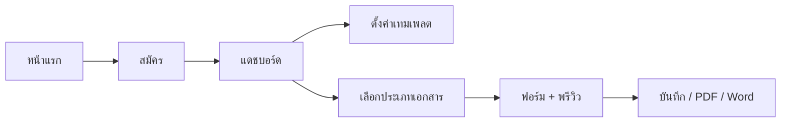
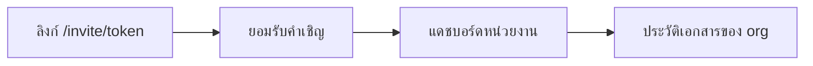

# EasyKrut — Userflow (ปัจจุบัน)

**อัปเดต:** 9 ส.ค. 2026 (คู่กับ OVERVIEW v1.2)  
ให้สอดคล้องกับโค้ดที่รองรับหนังสือภายนอก + ภายใน, เทมเพลตหน่วยงาน, invite, Stripe (เมื่อตั้งค่า env), และจุดสร้าง `/documents/new`

> ภาพรวมทั้งระบบ + ปัญหาที่เจออยู่ที่ [`OVERVIEW.md`](OVERVIEW.md)

---

## 1. ผู้ใช้ใหม่ (หน่วยงานแรก)

1. เปิด `/` → สมัครที่ `/register` (สร้าง User + Organization + Membership OWNER)
2. เข้า `/dashboard` — ถ้ายังไม่มีเอกสาร จะเห็น **เริ่มต้นใช้งานใน 3 ขั้น**
3. (แนะนำ) ตั้งเทมเพลตที่ `/org/settings` ให้เติมชื่อหน่วยงาน/ติดต่ออัตโนมัติ
4. กด **สร้างเอกสาร** → `/documents/new` เลือกประเภท
5. เข้า editor → บันทึกร่าง / FINAL → ส่งออก PDF หรือ Word

---

## 2. สร้างเอกสาร (ทางหลัก)

| ขั้น | เส้นทาง | หมายเหตุ |
|------|---------|----------|
| เข้าจุดสร้าง | `/documents/new` | จากแดชบอร์ดหรือประวัติเอกสาร |
| เลือกประเภท | ภายนอก / ภายใน | ประเภทอื่นแสดงเป็น “เร็วๆ นี้” |
| ชนโควตา | แสดงข้อความ + ลิงก์ `/pricing` | feature gate ตามแผน |
| แก้ไข | `/documents/[id]` | autosave + พรีวิว A4 |
| ส่งออก | PDF API / DOCX API / หน้าพิมพ์ | นับ UsageMeter |

---

## 3. ผู้ใช้ที่ถูกเชิญ

1. OWNER/ADMIN เชิญจาก `/org/settings`
2. ผู้รับเปิด `/invite/[token]` — สมัครใหม่หรือเข้าสู่ระบบแล้วเข้าร่วม
3. เห็นเอกสารของหน่วยงานตามบทบาท

---

## 4. ผู้ใช้กลับมาใช้ซ้ำ

1. `/login` → `/dashboard`
2. เปิดเอกสารล่าสุด หรือค้นจาก `/documents` (เรื่อง / วันที่ / ผู้สร้าง)
3. คัดลอกเอกสารเป็นฉบับใหม่ได้จากรายการ

---

## 5. อัปเกรดแผน

1. เมื่อสร้างเอกสารหรือเชิญสมาชิกชนลิมิต → ข้อความอัปเกรด
2. `/pricing` ดูแผน Free / Pro / Business
3. ถ้าตั้ง Stripe แล้ว → Checkout / Customer Portal จากหน้าหน่วยงาน

---

## จุดเข้า UI ที่เกี่ยวข้อง

- แดชบอร์ด: CTA `+ สร้างเอกสาร` + empty-state onboarding
- ประวัติเอกสาร: CTA เดียวกัน → `/documents/new`
- หน้าเลือกประเภท: ขั้นตอน เลือก → กรอก → ส่งออก
- หน้าแรก (marketing): สรุป 3 ขั้นสมัคร → สร้าง → ส่งออก

## หมายเหตุจากปัญหาที่เจอ

- อย่าสร้างเอกสารแบบข้าม `/documents/new` จากแดชบอร์ดโดยตรงอีก — รวมทางเข้าไว้ที่เดียว
- ประเภทที่ยังไม่พร้อมต้องติดป้าย “เร็วๆ นี้” เท่านั้น
- รายการปัญหาเต็ม: [`OVERVIEW.md` §9](OVERVIEW.md)
