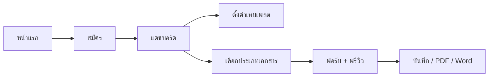
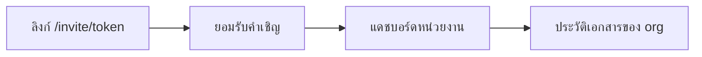

# EasyKrut — Userflow (ปัจจุบัน)

**อัปเดต:** 14 ส.ค. 2026 · คู่กับ OVERVIEW / PLAN **v1.5**  
ตรงกับโค้ด: ภายนอก + ภายใน + ประทับตรา, เทมเพลต, invite, Stripe (เมื่อตั้ง env), จุดสร้าง `/documents/new`

> ภาพรวม + แผนเฟส + ปัญหาที่เจอ: [`OVERVIEW.md`](OVERVIEW.md) · [`PLAN.md`](PLAN.md)

---

## 1. ผู้ใช้ใหม่ (หน่วยงานแรก)

1. เปิด `/` → สมัครที่ `/register` (สร้าง User + Organization + Membership OWNER + OrgTemplate ว่าง)
2. เข้า `/dashboard` — ถ้ายังไม่มีเอกสาร จะเห็น **เริ่มต้นใช้งานใน 3 ขั้น**
3. (แนะนำ) ตั้งเทมเพลตที่ `/org/settings`
4. กด **สร้างเอกสาร** → `/documents/new` เลือก **ภายนอก** / **ภายใน** / **ประทับตรา**
5. เข้า editor → บันทึกร่าง / FINAL → ส่งออก PDF หรือ Word (หรือหน้าพิมพ์)

---

## 2. สร้างเอกสาร (ทางหลัก)

| ขั้น | เส้นทาง | หมายเหตุ |
|------|---------|----------|
| เข้าจุดสร้าง | `/documents/new` | จากแดชบอร์ดหรือประวัติเท่านั้น |
| เลือกประเภท | ภายนอก / ภายใน / ประทับตรา | อื่นๆ = “เร็วๆ นี้” (สั่งการ · ประชาสัมพันธ์ · รับรอง · รายงานการประชุม) |
| ชนโควตา | ข้อความ + ลิงก์ `/pricing` | `canCreateDocument` |
| แก้ไข | `/documents/[id]` | autosave ~20s + พรีวิว A4 |
| ส่งออก | `/api/export/pdf` · `/api/export/docx` · `/print` | นับ `UsageMeter.exportsCount` |

---

## 3. ผู้ใช้ที่ถูกเชิญ

1. OWNER/ADMIN เชิญจาก `/org/settings` (อีเมลผ่าน Resend ถ้าตั้ง `RESEND_API_KEY` ไม่เช่นนั้น log คอนโซล)
2. ผู้รับเปิด `/invite/[token]` — สมัครใหม่หรือเข้าสู่ระบบแล้วเข้าร่วม
3. เห็นเอกสารของหน่วยงานตามบทบาท

---

## 4. ผู้ใช้กลับมาใช้ซ้ำ

1. `/login` → `/dashboard`
2. เปิดเอกสารล่าสุด หรือค้นจาก `/documents` (เรื่อง / วันที่ / ผู้สร้าง)
3. คัดลอกเป็นฉบับใหม่ได้จากรายการ

---

## 5. อัปเกรดแผน

1. สร้างเอกสารหรือเชิญสมาชิกชนลิมิต → ข้อความอัปเกรด
2. `/pricing` ดู Free / Pro / Business
3. ถ้าตั้ง Stripe แล้ว → Checkout / Customer Portal จาก `/org/settings`

---

## จุดเข้า UI

| จุด | เส้นทาง |
|-----|---------|
| หน้าแรก | `/` |
| สมัคร / เข้าสู่ระบบ | `/register` · `/login` |
| แดชบอร์ด | `/dashboard` |
| เลือกประเภท | `/documents/new` |
| ประวัติ | `/documents` |
| แก้ไข / พิมพ์ | `/documents/[id]` · `.../print` |
| หน่วยงาน | `/org/settings` |
| ราคา | `/pricing` |

## หมายเหตุ

- รวมทางเข้าสร้างเอกสารที่ `/documents/new` เท่านั้น  
- ประเภทไม่พร้อมต้องติดป้าย “เร็วๆ นี้”  
- แผนเฟส/acceptance: [`PLAN.md`](PLAN.md) · ปัญหาที่เจอ: [`OVERVIEW.md` §9](OVERVIEW.md)
